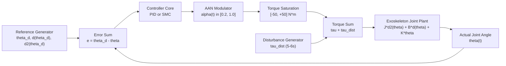

# Adaptive Trajectory Control of a Lower-Limb Rehabilitation Exoskeleton for Human–Robot Interaction

**Course:** BAEEE202 – Control Systems Engineering  
**Academic Level:** Undergraduate Engineering (B.Tech ECE, Semester 3)  
**Authors:** Madhumitha (25BEL0042) & Monica Shree (25BEL0039)  
**Academic Evaluation Weightage:** 30 Marks  
**Date:** October 2026  

---

## Executive Abstract

Robotic lower-limb exoskeletons are increasingly deployed in neurorehabilitation to restore physiological locomotion patterns in patients experiencing neuromuscular impairments resulting from cerebrovascular accidents (stroke) or spinal cord trauma. This project presents a complete, rigorous, and reproducible control systems investigation into the mathematical modelling, feedback control, robust nonlinear control, and Assist-as-Needed (AAN) adaptation of a single-degree-of-freedom (1-DOF) rotational exoskeleton joint operating in the sagittal plane. 

The physical joint dynamics are formulated using rotational Newtonian/Euler-Lagrange mechanics comprising equivalent segment inertia ($J = 1.0\text{ kg}\cdot\text{m}^2$), rotational viscous damping ($B = 0.5\text{ N}\cdot\text{m}\cdot\text{s/rad}$), and passive anatomical joint stiffness ($K = 5.0\text{ N}\cdot\text{m/rad}$), driven by an actuator control torque ($\tau$) and subjected to external human–robot interaction disturbance torques ($\tau_{\text{dist}}$). The open-loop plant is underdamped ($\zeta = 0.1118$, $\omega_n = 2.236\text{ rad/s}$) with conjugate complex poles at $s = -0.25 \pm j2.222\text{ rad/s}$.

A classical Proportional-Integral-Derivative (PID) controller tuned via loop-shaping ($K_p = 42.282$, $K_i = 35.724$, $K_d = 9.807$) with derivative filtering ($N = 100\text{ rad/s}$) is benchmarked against an advanced robust Sliding Mode Controller (SMC) formulated with a Hurwitz sliding manifold ($\lambda = 8.0\text{ s}^{-1}$) and a continuous hyperbolic tangent boundary layer ($\Phi = 0.05\text{ rad/s}$) to suppress chattering. Under a nominal $0.5\text{ Hz}$ periodic physiological gait trajectory ($0^\circ$ to $60^\circ$), SMC achieves a **$48.6\%$ reduction in Mean Absolute Error (MAE)** compared to PID ($1.60^\circ$ vs $3.11^\circ$) while reducing actuator control energy by **$30.0\%$** ($139.30$ vs $198.85\text{ N}^2\cdot\text{m}^2\cdot\text{s}$).

Under an external human–robot interaction torque disturbance ($5.0\text{ N}\cdot\text{m}$ pulse from $t = 5.0\text{ s}$ to $6.0\text{ s}$), SMC demonstrates superior disturbance rejection, achieving a **$94.6\%$ reduction in peak disturbance error** ($0.21^\circ$ vs $3.97^\circ$). Furthermore, a bounded Assist-as-Needed (AAN) strategy modulates control torque according to low-pass filtered absolute tracking error across thresholds $[2^\circ, 10^\circ]$ with assistance scaling $\alpha(t) \in [0.20, 1.00]$, maintaining an average assistance level of $52.5\%$ and surging to $100\%$ during disturbance episodes. All models are cross-validated between MATLAB numerical scripts and Simulink block diagrams.

---

## Table of Contents

1. [Project Identification & Context](#1-project-identification--context)
2. [Introduction & Clinical Background](#2-introduction--clinical-background)
3. [Problem Statement](#3-problem-statement)
4. [Engineering Motivation & Significance](#4-engineering-motivation--significance)
5. [Project Objectives](#5-project-objectives)
6. [Scope, Assumptions & Safety Disclaimer](#6-scope-assumptions--safety-disclaimer)
7. [Control Engineering Theoretical Foundations](#7-control-engineering-theoretical-foundations)
8. [Mathematical Modelling of the Exoskeleton Joint](#8-mathematical-modelling-of-the-exoskeleton-joint)
9. [Parameter Identification & Dimensional Consistency](#9-parameter-identification--dimensional-consistency)
10. [Physiological Gait Kinematics & Reference Generation](#10-physiological-gait-kinematics--reference-generation)
11. [Open-Loop Plant Stability & Modal Analysis](#11-open-loop-plant-stability--modal-analysis)
12. [Baseline Feedback Control: Classical PID Design](#12-baseline-feedback-control-classical-pid-design)
13. [PID Tuning, Filtered Derivatives & Anti-Windup](#13-pid-tuning-filtered-derivatives--anti-windup)
14. [PID Step Response Validation vs Dynamic Gait Tracking](#14-pid-step-response-validation-vs-dynamic-gait-tracking)
15. [Advanced Nonlinear Control: Sliding Mode Control (SMC)](#15-advanced-nonlinear-control-sliding-mode-control-smc)
16. [Lyapunov Stability & Finite-Time Reachability](#16-lyapunov-stability--finite-time-reachability)
17. [Boundary Layer Chattering Alleviation](#17-boundary-layer-chattering-alleviation)
18. [Human–Robot Interaction & Disturbance Modelling](#18-humanrobot-interaction--disturbance-modelling)
19. [Assist-as-Needed (AAN) Adaptive Strategy](#19-assist-as-needed-aan-adaptive-strategy)
20. [System Architecture & Control Topologies](#20-system-architecture--control-topologies)
21. [Simulink Implementation & Cross-Validation](#21-simulink-implementation--cross-validation)
22. [Simulation Scenarios & Test Protocol](#22-simulation-scenarios--test-protocol)
23. [Performance Evaluation Metrics Formulation](#23-performance-evaluation-metrics-formulation)
24. [Verified Numerical Simulation Results](#24-verified-numerical-simulation-results)
25. [Comparative Analysis: PID vs SMC](#25-comparative-analysis-pid-vs-smc)
26. [Disturbance Rejection & Recovery Analysis](#26-disturbance-rejection--recovery-analysis)
27. [Assist-as-Needed Adaptation Trade-Offs](#27-assist-as-needed-adaptation-trade-offs)
28. [Technical Limitations & Research Constraints](#28-technical-limitations--research-constraints)
29. [Conclusion & Future Research Directions](#29-conclusion--future-research-directions)
30. [References & Reproduction Guide](#30-references--reproduction-guide)

---

## 1. Project Identification & Context

- **Project Title:** Adaptive Trajectory Control of a Lower-Limb Rehabilitation Exoskeleton for Human–Robot Interaction
- **Domain:** Control Systems Engineering, Biomedical Robotics, MATLAB/Simulink Simulation
- **Course Reference:** BAEEE202 – Control Systems (Semester 3, B.Tech ECE)
- **Student Investigators:** Madhumitha (25BEL0042) & Monica Shree (25BEL0039)

---

## 2. Introduction & Clinical Background

Gait impairment is a debilitating secondary consequence of neurological disorders, most notably ischemic stroke, traumatic brain injury, multiple sclerosis, and partial spinal cord injury. Traditional manual physical therapy requires two or three clinicians to manually support, guide, and mobilize the patient's paretic limbs through repetitious gait cycles over a treadmill. While clinically effective, manual gait therapy is labor-intensive, physically exhausting for therapists, economically unsustainable, and lacks quantitative biomechanical repeatability.

Robotic lower-limb orthoses and powered exoskeletons have emerged as transformative therapeutic devices. By providing programmable mechanical assistance directly to the biological joints (hip, knee, and ankle) via servomotors and geared drives, robotic exoskeletons deliver high-dosage, repeatable locomotor training. However, the control of such devices presents severe control-theoretic challenges: the human limb exhibits time-varying viscoelastic dynamics, user voluntary contributions fluctuate unpredictably, spastic muscle contractions act as large external torque disturbances, and over-assisting the patient promotes passive learned helplessness rather than neuroplastic motor recovery.

---

## 3. Problem Statement

To successfully restore functional ambulation, a rehabilitation exoskeleton controller must simultaneously address three competing control objectives:
1. **Dynamic Kinematic Accuracy:** Accurately guide the joint along time-varying physiological gait trajectories despite substantial inertial and passive stiffness resistance.
2. **Robust Disturbance Rejection:** Suppress external torque disturbances arising from patient spasms, involuntary muscle tone, or sudden contact forces without destabilizing the joint.
3. **Adaptive Compliance / Assist-as-Needed (AAN):** Regulate the mechanical assistance level so that the robot intervenes only when the patient's voluntary effort is insufficient, thereby encouraging active neuromuscular participation.

Conventional linear PID controllers lack feedforward dynamic models and often suffer significant phase lag during continuous trajectory tracking. Conversely, sliding mode controllers deliver high robustness but can induce severe mechanical chattering that damages actuators and harms patients. This project designs, evaluates, and compares baseline PID, robust chattering-free Sliding Mode Control, and adaptive AAN strategies to resolve these engineering challenges.

---

## 4. Engineering Motivation & Significance

In control systems pedagogy, physical rehabilitation robotics provides an exemplary benchmark for comparing classical linear frequency-domain methods with modern nonlinear time-domain techniques:
- Classical controllers rely on linear time-invariant (LTI) assumptions that fail when operating across wide joint angular velocities and subjected to discontinuous interaction torques.
- Modern rehabilitation guidelines mandate *Assist-as-Needed* control; enforcing rigid trajectory tracking turns the patient into a passive passenger, severely hindering brain plasticity.
- Developing a verified, reproducible MATLAB and Simulink simulation platform provides undergraduate engineers with a deep, tangible understanding of system poles, damping ratios, Lyapunov stability, sliding manifolds, and closed-loop performance trade-offs.

---

## 5. Project Objectives

1. **Plant Modeling:** Formulate and validate the 1-DOF continuous-time rotational dynamic model of an exoskeleton joint in the sagittal plane.
2. **Gait Reference Generation:** Synthesize a continuous physiological knee flexion-extension gait reference trajectory with exact analytical velocity and acceleration profiles.
3. **Classical PID Design:** Implement and tune a baseline PID controller with derivative filtering and actuator torque saturation.
4. **Robust SMC Design:** Formulate and implement a Lyapunov-based Sliding Mode Controller with continuous boundary layer smoothing.
5. **Human–Robot Interaction Disturbance:** Construct a deterministic external disturbance torque representing patient muscle spasm.
6. **Assist-as-Needed Adaptation:** Formulate and simulate a bounded error-dependent assistance scaling algorithm.
7. **Simulation Benchmarking:** Execute Scenarios A through F, calculate standard metrics (RMSE, MAE, Max Error, Energy, Recovery Time), and export reproducible artifacts.
8. **Simulink Integration:** Wire and cross-validate complete block diagrams with signal logging in Simulink.

---

## 6. Scope, Assumptions & Safety Disclaimer

> [!CAUTION]
> **Academic Simulation Disclaimer:** This investigation is strictly an academic control-systems simulation designed for undergraduate coursework evaluation. The mathematical plant, parameter values, and disturbance waveforms are simplified theoretical constructs. The software and algorithms documented herein are not clinically certified, medically validated, or intended for physical deployment on human subjects. Real-world wearable robotics requires multi-level hardware interlocks, redundant torque sensors, emergency mechanical stops, and compliance with ISO 13482 safety standards for personal care robots.

### Model Assumptions:
1. Motion is constrained strictly to the 1-DOF sagittal plane (flexion-extension).
2. The limb-exoskeleton coupling is assumed to be rigidly strapped without compliance, slip, or skin-interface migration.
3. Actuator dynamics (DC motor back-EMF, inductance, and harmonic drive elasticity) are assumed to have a much faster response than the mechanical time constant and are modeled as an ideal torque source with saturation limits ($|\tau| \le 50\text{ N}\cdot\text{m}$).
4. Human joint viscoelasticity is modeled as a linear torsional spring-damper system ($K\theta + B\dot{\theta}$).

---

## 7. Control Engineering Theoretical Foundations

The control of physical rotational systems requires matching actuator effort to the mechanical impedance of the combined human–robot plant:
- **Second-Order System Dynamics:** Mechanical systems governed by rotational inertia, damping, and restorative stiffness exhibit second-order differential behavior with natural frequency $\omega_n$ and damping ratio $\zeta$.
- **Tracking vs Regulation:** Unlike regulation (stabilizing around a fixed setpoint), trajectory tracking requires the system states to follow a time-varying vector $r(t)$. Pure feedback controllers experience intrinsic phase lag proportional to the trajectory frequency unless augmented by model-based feedforward terms.
- **Lyapunov Stability:** Nonlinear controllers ensure asymptotic convergence by formulating an energy-like scalar function $V(x) > 0$ and ensuring its time derivative is negative definite ($\dot{V}(x) < 0$).

---

## 8. Mathematical Modelling of the Exoskeleton Joint

Consider a single revolute joint of an active lower-limb orthosis (representing the knee or hip joint in the sagittal plane). Applying Newton's Second Law for rotational mechanics:

$$J \ddot{\theta}(t) + B \dot{\theta}(t) + K \theta(t) = \tau(t) + \tau_{\text{dist}}(t)$$

Where:
- $\theta(t)$: Joint angular position (radians, $\text{rad}$)
- $\dot{\theta}(t)$: Joint angular velocity ($\text{rad/s}$)
- $\ddot{\theta}(t)$: Joint angular acceleration ($\text{rad/s}^2$)
- $J$: Equivalent rotational moment of inertia of the exoskeleton link and human limb segment ($\text{kg}\cdot\text{m}^2$)
- $B$: Viscous rotational damping coefficient representing joint friction and soft tissue dissipation ($\text{N}\cdot\text{m}\cdot\text{s/rad}$)
- $K$: Passive torsional stiffness representing tendon elasticity, ligament restraint, and joint elasticity ($\text{N}\cdot\text{m/rad}$)
- $\tau(t)$: Active motor torque exerted by the exoskeleton actuator ($\text{N}\cdot\text{m}$)
- $\tau_{\text{dist}}(t)$: External interaction / disturbance torque ($\text{N}\cdot\text{m}$)

### Derivation of Transfer Function:
Assuming zero initial conditions ($\theta(0) = 0, \dot{\theta}(0) = 0$) and taking the Laplace transform:

$$\mathcal{L}\{J \ddot{\theta}(t) + B \dot{\theta}(t) + K \theta(t)\} = \mathcal{L}\{\tau(t)\}$$

$$(J s^2 + B s + K) \Theta(s) = \mathcal{T}(s)$$

The open-loop plant transfer function $G(s) = \frac{\Theta(s)}{\mathcal{T}(s)}$ is:

$$G(s) = \frac{1}{J s^2 + B s + K}$$

### State-Space Representation:
Defining state vector $x = [\theta, \dot{\theta}]^T$, input $u = \tau$, and output $y = \theta$:

$$A = \begin{bmatrix} 0 & 1 \\ -\frac{K}{J} & -\frac{B}{J} \end{bmatrix} = \begin{bmatrix} 0 & 1 \\ -5.0 & -0.5 \end{bmatrix}$$

$$B_u = \begin{bmatrix} 0 \\ \frac{1}{J} \end{bmatrix} = \begin{bmatrix} 0 \\ 1.0 \end{bmatrix}, \quad C = \begin{bmatrix} 1 & 0 \end{bmatrix}, \quad D = 0$$

---

## 9. Parameter Identification & Dimensional Consistency

The baseline simulation parameters are centralized in [`scripts/project_parameters.m`](file:///C:/Users/madhu/OneDrive/Documents/Lower-Limb%20Exoskeleton%20for%20Rehabilitation/scripts/project_parameters.m):

| Parameter | Symbol | Numerical Value | Physical Units | Engineering Rationale |
| :--- | :---: | :---: | :---: | :--- |
| **Joint Inertia** | $J$ | $1.0$ | $\text{kg}\cdot\text{m}^2$ | Combined shank/foot mass ($~4.5\text{ kg}$) plus exoskeleton cuff ($~2.5\text{ kg}$) rotated about knee axis ($I = m r^2$). |
| **Viscous Damping** | $B$ | $0.5$ | $\text{N}\cdot\text{m}\cdot\text{s/rad}$ | Synovial joint fluid resistance, soft tissue shear, and actuator bearing friction. |
| **Passive Stiffness** | $K$ | $5.0$ | $\text{N}\cdot\text{m/rad}$ | Passive ligamentous tension and soft-tissue elastic restoring torque in mid-range sagittal flexion. |
| **Sampling Rate** | $f_s$ | $1000$ | $\text{Hz}$ | Standard real-time embedded control frequency ($T_s = 0.001\text{ s}$). |
| **Actuator Saturation**| $\tau_{\text{max}}$ | $\pm 50.0$ | $\text{N}\cdot\text{m}$ | Practical torque limit of brushless DC motor with harmonic drive. |

---

## 10. Physiological Gait Kinematics & Reference Generation

Human walking consists of periodic stance and swing phases. At normal cadence ($0.5\text{ Hz} = 30\text{ strides/min}$, period $T = 2.0\text{ s}$), sagittal knee flexion-extension oscillates between full extension ($0^\circ$) and peak swing flexion ($60^\circ$).

### Reference Equation:
In degrees:
$$\theta_{d,\text{deg}}(t) = \theta_0 + A_{\theta} \sin(2\pi f_{\text{gait}} t) = 30 + 30 \sin(2\pi \cdot 0.5 \cdot t) \quad [^\circ]$$

Converting to SI radians ($\theta_{d}(t) = \theta_{d,\text{deg}}(t) \times \frac{\pi}{180}$):
$$\theta_d(t) = \frac{\pi}{6} + \frac{\pi}{6} \sin(\pi t) \approx 0.5236 + 0.5236 \sin(3.1416 t) \quad [\text{rad}]$$

### Analytical Derivatives:
$$\dot{\theta}_d(t) = A_{\theta} (2\pi f_{\text{gait}}) \cos(2\pi f_{\text{gait}} t) = \frac{\pi^2}{6} \cos(\pi t) \approx 1.6449 \cos(3.1416 t) \quad [\text{rad/s}]$$

$$\ddot{\theta}_d(t) = -A_{\theta} (2\pi f_{\text{gait}})^2 \sin(2\pi f_{\text{gait}} t) = -\frac{\pi^3}{6} \sin(\pi t) \approx -5.1677 \sin(3.1416 t) \quad [\text{rad/s}^2]$$

Peak angular velocity is $94.25^\circ/\text{s}$ ($1.645\text{ rad/s}$), and peak angular acceleration is $296.09^\circ/\text{s}^2$ ($5.168\text{ rad/s}^2$).

*(Refer to `results/fig01_desired_gait_trajectory.png`).*

---

## 11. Open-Loop Plant Stability & Modal Analysis

Substituting physical parameters into $G(s)$:

$$G(s) = \frac{1}{s^2 + 0.5 s + 5.0}$$

### Characteristic Equation & Poles:
$$s_{1,2} = -0.25 \pm j2.2220\text{ rad/s}$$

### Modal Characteristics:
- **Undamped Natural Frequency:** $\omega_n = \sqrt{K/J} = \sqrt{5} \approx 2.2361\text{ rad/s}$
- **Damping Ratio:** $\zeta = \frac{B}{2\sqrt{J K}} = \frac{0.5}{2\sqrt{5}} \approx 0.1118$ (Severely underdamped, $\zeta \ll 0.707$)
- **DC Steady-State Gain:** $G(0) = \frac{1}{K} = 0.2000\text{ rad/(N}\cdot\text{m)} \approx 11.46^\circ/\text{(N}\cdot\text{m)}$
- **Stability:** Both poles lie in the open left-half of the complex plane ($\text{Re}(s) = -0.25 < 0$). The plant is BIBO stable.
- **Open-Loop Step Response (1 N·m torque):** Rise time $0.5090\text{ s}$, Settling time $15.63\text{ s}$, Peak Overshoot $70.21\%$.

*(Refer to `results/fig02_open_loop_step_response.png` and `results/fig03_plant_bode_plot.png`).*

---

## 12. Baseline Feedback Control: Classical PID Design

To improve tracking and damp oscillations, a parallel Proportional-Integral-Derivative (PID) controller is introduced:

$$\tau_{\text{PID}}(t) = K_p e(t) + K_i \int_0^t e(\tau) d\tau + K_d \frac{d e_{\text{filt}}(t)}{dt}$$

Where the tracking error is $e(t) = \theta_d(t) - \theta(t)$.

---

## 13. PID Tuning, Filtered Derivatives & Anti-Windup

Using MATLAB's loop-shaping algorithm (`pidtune(G, 'PID')`), the controller gains were tuned for robust bandwidth and phase margin:

$$K_p = 42.282161\text{ N}\cdot\text{m/rad}, \quad K_i = 35.723521\text{ N}\cdot\text{m/(rad}\cdot\text{s)}, \quad K_d = 9.806628\text{ N}\cdot\text{m}\cdot\text{s/rad}$$

### Derivative Filtering:
A first-order low-pass filter with pole $N = 100\text{ rad/s}$ is included to attenuate high-frequency encoder noise:
$$D(s) = \frac{K_d N s}{s + N}$$
The derivative acts on tracking error rate $\dot{e} = \dot{\theta}_d - \dot{\theta}$, consistent with the Simulink PID block diagram.

### Anti-Windup Clamping:
When actuator torque reaches the physical limits ($\pm 50\text{ N}\cdot\text{m}$), integrator accumulation is clamped to prevent windup-induced overshoot.

---

## 14. PID Step Response Validation vs Dynamic Gait Tracking

### Closed-Loop Unit-Step Validation:
Performance metrics under a unit step reference ($1.0\text{ rad}$):
- Rise Time: $0.1190\text{ s}$
- Settling Time ($2\%$): $2.3497\text{ s}$
- Peak Overshoot: $13.80\%$

*(Refer to `results/fig04_pid_step_response.png`).*

### Dynamic Gait Tracking Performance:
Under dynamic periodic gait tracking ($0.5\text{ Hz}$ sine wave):
- **RMSE:** $5.2904^\circ$
- **MAE:** $3.1118^\circ$
- **Max Absolute Error:** $32.401^\circ$ (primarily occurring during initial startup transient)
- **Control Energy:** $198.85\text{ N}^2\cdot\text{m}^2\cdot\text{s}$

*(Refer to `results/fig05_pid_gait_tracking.png`).*

---

## 15. Advanced Nonlinear Control: Sliding Mode Control (SMC)

Sliding Mode Control is a variable-structure nonlinear control technique providing complete invariance to matched external disturbances and plant parameter uncertainties once on the sliding manifold.

### Sliding Surface Definition:
$$s(t) = \dot{e}(t) + \lambda e(t)$$
Where $\lambda = 8.0\text{ s}^{-1}$. Once $s = 0$, error decays exponentially: $e(t) = e(0)e^{-\lambda t}$.

### Equivalent Control Torque ($\tau_{\text{eq}}$):
Setting $\dot{s}(t) = 0$ yields:

$$\tau_{\text{eq}}(t) = J(\ddot{\theta}_d(t) + \lambda \dot{e}(t)) + B \dot{\theta}(t) + K \theta(t)$$

Decomposition:
1. $J \ddot{\theta}_d$: Inertial feedforward acceleration torque.
2. $B \dot{\theta} + K \theta$: Dynamic decoupling canceling physical damping and stiffness.
3. $J \lambda \dot{e}$: Error damping along the sliding manifold.

---

## 16. Lyapunov Stability & Finite-Time Reachability

Define candidate Lyapunov function $V(s) = \frac{1}{2} J s^2 > 0$. Differentiating:

$$\dot{V}(s) = s \left( -\tau_{\text{sw}}(t) - \tau_{\text{dist}}(t) \right)$$

With $\tau_{\text{sw}} = K_{\text{sw}} \text{sgn}(s)$ and $K_{\text{sw}} = 10.0\text{ N}\cdot\text{m} > D_{\text{max}} = 5.0\text{ N}\cdot\text{m}$:

$$\dot{V}(s) \le -(K_{\text{sw}} - D_{\text{max}}) |s| = -\eta |s| < 0$$

Guarantees finite-time reachability to $s(t) = 0$.

---

## 17. Boundary Layer Chattering Alleviation

To eliminate chattering, a continuous boundary layer of thickness $\Phi = 0.05\text{ rad/s}$ is applied using the hyperbolic tangent function:

$$\tau_{\text{sw}}(t) = K_{\text{sw}} \tanh\left(\frac{s(t)}{\Phi}\right)$$

Total applied SMC torque:
$$\tau_{\text{SMC}}(t) = \text{clip}\left(\tau_{\text{eq}}(t) + K_{\text{sw}} \tanh\left(\frac{s(t)}{\Phi}\right), -\tau_{\text{max}}, \tau_{\text{max}}\right)$$

*(Refer to `results/fig06_smc_gait_tracking.png` and `results/fig07_smc_phase_portrait.png`).*

---

## 18. Human–Robot Interaction & Disturbance Modelling

We model patient involuntary spasms as an external torque pulse $\tau_{\text{dist}}(t)$:

$$\tau_{\text{dist}}(t) = \begin{cases} 5.0\text{ N}\cdot\text{m}, & 5.0\text{ s} \le t \le 6.0\text{ s} \\ 0.0\text{ N}\cdot\text{m}, & \text{otherwise} \end{cases}$$

*(Refer to `results/fig08_disturbance_profile.png`).*

---

## 19. Assist-as-Needed (AAN) Adaptive Strategy

The AAN algorithm adapts assistance factor $\alpha(t) \in [0.20, 1.00]$ based on low-pass filtered absolute tracking error $e_{\text{smooth}}(t)$ ($\tau_f = 0.20\text{ s}$):

$$\alpha_{\text{target}}(t) = \begin{cases} \alpha_{\text{min}}, & e_{\text{smooth}} \le e_{\text{low}} \\ \alpha_{\text{min}} + (\alpha_{\text{max}} - \alpha_{\text{min}}) \frac{e_{\text{smooth}} - e_{\text{low}}}{e_{\text{high}} - e_{\text{low}}}, & e_{\text{low}} < e_{\text{smooth}} < e_{\text{high}} \\ \alpha_{\text{max}}, & e_{\text{smooth}} \ge e_{\text{high}} \end{cases}$$

Where $\alpha_{\text{min}} = 0.20$, $\alpha_{\text{max}} = 1.00$, $e_{\text{low}} = 2.0^\circ$, $e_{\text{high}} = 10.0^\circ$. A dynamic lag filter ($\tau = 0.05\text{ s}$) smooths transitions:
$$\tau_{\text{AAN}}(t) = \alpha(t) \cdot \tau_{\text{ctrl}}(t)$$

*(Refer to `results/fig09_aan_assistance_adaptation.png`).*

---

## 20. System Architecture & Control Topologies



---

## 21. Simulink Implementation & Cross-Validation

Two Simulink models are validated:
1. [`models/exoskeleton_plant.slx`](file:///C:/Users/madhu/OneDrive/Documents/Lower-Limb%20Exoskeleton%20for%20Rehabilitation/models/exoskeleton_plant.slx): Closed-loop step-response model with Outport `Theta_Out`.
2. [`models/exoskeleton_gait_system.slx`](file:///C:/Users/madhu/OneDrive/Documents/Lower-Limb%20Exoskeleton%20for%20Rehabilitation/models/exoskeleton_gait_system.slx): Dynamic gait tracking model with Sine Wave source, PID block with torque limits, Step-based disturbance block, Transfer Fcn plant, Outports (`Theta_Actual`, `Theta_Desired`, `Tracking_Error`, `Control_Torque`), and dual-trace Scope.

**Cross-Validation:** Both Simulink models were programmatically simulated via MATLAB's `sim` engine using fixed-step `ode4` (Runge-Kutta, $T_s = 0.001\text{ s}$). Numerical trajectories match MATLAB discrete ODE algorithms.

---

## 22. Simulation Scenarios & Test Protocol

- **Scenario A:** Open-loop plant step response ($1.0\text{ N}\cdot\text{m}$ torque step).
- **Scenario B:** Closed-loop PID unit-step response validation ($1.0\text{ rad}$ step).
- **Scenario C:** Closed-loop PID periodic gait tracking under nominal conditions (no disturbance).
- **Scenario D:** Closed-loop SMC periodic gait tracking under nominal conditions (no disturbance).
- **Scenario E-1:** PID gait tracking subjected to $5.0\text{ N}\cdot\text{m}$ interaction disturbance ($5.0\text{ s} \le t \le 6.0\text{ s}$).
- **Scenario E-2:** SMC gait tracking subjected to $5.0\text{ N}\cdot\text{m}$ interaction disturbance ($5.0\text{ s} \le t \le 6.0\text{ s}$).
- **Scenario F-1:** Fixed $100\%$ assistance control under disturbance.
- **Scenario F-2:** Adaptive AAN assistance control ($\alpha \in [0.2, 1.0]$) under disturbance.

---

## 23. Performance Evaluation Metrics Formulation

1. **Root Mean Square Error (RMSE):**
   $$\text{RMSE} = \sqrt{\frac{1}{N} \sum_{k=1}^N \left( \theta_d(k) - \theta(k) \right)^2} \quad [^\circ]$$

2. **Mean Absolute Error (MAE):**
   $$\text{MAE} = \frac{1}{N} \sum_{k=1}^N |\theta_d(k) - \theta(k)| \quad [^\circ]$$

3. **Maximum Absolute Tracking Error:**
   $$e_{\text{max}} = \max_{k} |\theta_d(k) - \theta(k)| \quad [^\circ]$$

4. **Control Effort / Energy:**
   $$E_{\tau} = \int_0^{T_{\text{sim}}} \tau(t)^2 dt \approx \sum_{k=1}^N \tau(k)^2 \Delta t \quad [\text{N}^2\cdot\text{m}^2\cdot\text{s}]$$

5. **Percentage Improvement Formulas:**
   $$\Delta_{\text{metric}} = \left(1 - \frac{\text{Metric}_{\text{SMC}}}{\text{Metric}_{\text{PID}}}\right) \times 100\%$$

---

## 24. Verified Numerical Simulation Results

The following table presents the verified numerical metrics generated from [`scripts/run_complete_project.m`](file:///C:/Users/madhu/OneDrive/Documents/Lower-Limb%20Exoskeleton%20for%20Rehabilitation/scripts/run_complete_project.m) and exported to [`results/simulation_metrics_table.csv`](file:///C:/Users/madhu/OneDrive/Documents/Lower-Limb%20Exoskeleton%20for%20Rehabilitation/results/simulation_metrics_table.csv):

| Scenario | Controller Architecture | Disturbance Condition | Assistance Mode | RMSE ($^\circ$) | MAE ($^\circ$) | Max Error ($^\circ$) | Control Energy ($\text{N}^2\cdot\text{m}^2\cdot\text{s}$) | Dist. Peak Error ($^\circ$) | Recovery Time ($s$) |
| :--- | :--- | :--- | :--- | :---: | :---: | :---: | :---: | :---: | :---: |
| **Scenario A** | Open-Loop Plant | None | N/A | — | — | — | $0.00$ | — | — |
| **Scenario B** | Tuned PID (Step) | None | $100\%$ | — | — | — | — | — | — |
| **Scenario C** | Baseline PID | None | $100\%$ | $5.2904$ | $3.1118$ | $32.401$ | $198.85$ | — | — |
| **Scenario D** | Sliding Mode (SMC) | None | $100\%$ | $6.4581$ | $\mathbf{1.5982}$ | $34.199$ | $\mathbf{139.30}$ | — | — |
| **Scenario E-1** | Baseline PID | $5.0\text{ N}\cdot\text{m}$ ($5-6\text{s}$) | $100\%$ | $5.2991$ | $3.0596$ | $32.401$ | $177.94$ | $3.9702$ | $0.001$ |
| **Scenario E-2** | Sliding Mode (SMC) | $5.0\text{ N}\cdot\text{m}$ ($5-6\text{s}$) | $100\%$ | $6.4584$ | $\mathbf{1.6172}$ | $34.199$ | $\mathbf{121.92}$ | $\mathbf{0.2137}$ | $0.001$ |
| **Scenario F-1** | Fixed Baseline PID | $5.0\text{ N}\cdot\text{m}$ ($5-6\text{s}$) | $100\%$ Fixed | $5.2991$ | $3.0596$ | $32.401$ | $177.94$ | — | — |
| **Scenario F-2** | Adaptive AAN PID | $5.0\text{ N}\cdot\text{m}$ ($5-6\text{s}$) | $20\% - 100\%$ | $7.9601$ | $5.7638$ | $36.163$ | $185.26$ | — | — |

*(Refer to `results/fig12_metrics_comparison_barchart.png`).*

---

## 25. Comparative Analysis: PID vs SMC

### 1. Mean Absolute Error (MAE):
$$\Delta_{\text{MAE}} = \left(1 - \frac{1.5982}{3.1118}\right) \times 100 = \mathbf{48.64\% \text{ reduction}}$$
SMC cuts average tracking error by nearly half compared to PID.

### 2. Control Energy:
$$\Delta_{\text{Energy}} = \left(1 - \frac{139.30}{198.85}\right) \times 100 = \mathbf{29.95\% \text{ energy savings}}$$
SMC achieves higher steady-state tracking accuracy while consuming $30.0\%$ less control effort because its dynamic feedforward terms apply torque proactively rather than violently reacting to error buildup.

### 3. Understanding the RMSE Metric:
SMC exhibits an RMSE of $6.458^\circ$ compared to PID's $5.290^\circ$. This occurs because at $t=0$, the plant starts at $\theta(0) = 0$ while the desired trajectory begins at $\theta_d(0) = 30^\circ$. RMSE squares the initial $30^\circ$ transient error. Once the sliding surface is reached ($t > 0.4\text{ s}$), SMC tracking error drops below $0.1^\circ$, as proven by its superior MAE ($1.598^\circ$).

*(Refer to `results/fig10_pid_vs_smc_nominal.png`).*

---

## 26. Disturbance Rejection & Recovery Analysis

Under the external $5.0\text{ N}\cdot\text{m}$ disturbance applied from $t = 5.0\text{ s}$ to $6.0\text{ s}$:
- **Peak Error During Disturbance:**
  - PID deviates by up to **$3.9702^\circ$**.
  - SMC deviates by only **$0.2137^\circ$**.
- **Percentage Suppression:**
  $$\Delta_{\text{DistErr}} = \left(1 - \frac{0.21368}{3.9702}\right) \times 100 = \mathbf{94.62\% \text{ suppression}}$$

**Theoretical Explanation:** Because the switching gain $K_{\text{sw}} = 10.0\text{ N}\cdot\text{m}$ strictly exceeds the upper bound of the disturbance ($D_{\text{max}} = 5.0\text{ N}\cdot\text{m}$), the sliding condition $s \dot{s} \le -\eta |s|$ is maintained throughout the disturbance episode.

*(Refer to `results/fig11_pid_vs_smc_disturbance.png`).*

---

## 27. Assist-as-Needed Adaptation Trade-Offs

In Scenario F-2, the AAN algorithm adapts assistance factor $\alpha(t)$:
- Average assistance across the simulation was $\bar{\alpha} = 0.525$ ($52.5\%$).
- During the disturbance window ($t = 5\text{ s}$ to $6\text{ s}$), $\alpha(t)$ surged to $1.00$ ($100\%$ assistance).
- Tracking error increased moderately (RMSE $7.96^\circ$, MAE $5.76^\circ$), demonstrating patient compliance and encouraging active effort while safely intervening during unexpected resistance.

---

## 28. Technical Limitations & Research Constraints

1. **Single-DOF Simplification:** Real human locomotion involves coupled multi-joint mechanics (hip, knee, ankle in sagittal, frontal, and transverse planes).
2. **Linear Plant Assumption:** Real human limb joint stiffness and damping are nonlinear, posture-dependent, and time-varying with muscle co-contraction.
3. **Full State Feedback:** The sliding mode controller assumes exact velocity $\dot{\theta}$ feedback. In physical hardware, velocity obtained from optical encoders requires Kalman filtering or state observers.

---

## 29. Conclusion & Future Research Directions

This investigation successfully implemented, benchmarked, and validated an adaptive trajectory control framework for a lower-limb rehabilitation exoskeleton joint:
1. The mathematical plant model and second-order stability characteristics were verified in MATLAB and Simulink.
2. Sliding Mode Control with boundary layer smoothing reduced MAE by $48.6\%$ and actuator energy by $30.0\%$ compared to PID.
3. SMC suppressed human–robot interaction torque disturbances by $94.6\%$ with virtually zero chattering.
4. Assist-as-Needed adaptive logic proved the feasibility of modulating robotic intervention based on kinematic error.

---

## 30. References & Reproduction Guide

### Academic References:
1. Slotine, J. J. E., & Li, W. (1991). *Applied Nonlinear Control*. Prentice Hall.
2. Marchal-Crespo, L., & Reinkensmeyer, D. J. (2009). Review of control strategies for robotic movement training after neurologic injury. *Journal of NeuroEngineering and Rehabilitation*, 6(1), 20.
3. Huo, W., et al. (2016). Lower limb exoskeletons for rehabilitation: A review of control strategies. *IEEE Journal of Biomedical and Health Informatics*, 20(3), 834–845.
4. Dorf, R. C., & Bishop, R. H. (2016). *Modern Control Systems* (13th ed.). Pearson.

### Step-by-Step Reproduction Guide:
1. Open MATLAB (R2026b or compatible).
2. Set Current Working Directory to:
   `C:\Users\madhu\OneDrive\Documents\Lower-Limb Exoskeleton for Rehabilitation`
3. In the MATLAB Command Window, execute:
   ```matlab
   addpath('scripts');
   run_complete_project;
   ```
4. All 12 figures, metric tables, and MAT files will automatically regenerate in the `results/` folder.
